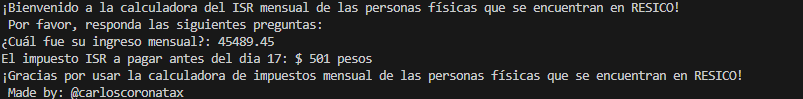

# Calculadora RESICO PF

Este proyecto es una calculadora para el Régimen Simplificado de Confianza (RESICO) para Personas Físicas en México. La calculadora permite a los usuarios calcular sus impuestos de manera sencilla y rápida.

## Características

- Cálculo de impuestos basado en el régimen RESICO.
- Interfaz de usuario amigable.
- Resultados detallados y fáciles de entender.

## Requisitos

- Python 3.8 o superior
- Librería estándar de Python (`math`)

## Instalación

1. Clona el repositorio:
    ```bash
    git clone https://github.com/carloscoronatax/calculadora_resico_pf.git
    ```
2. Navega al directorio del proyecto:
    ```bash
    cd calculadora_resico_pf
    ```

## Uso

1. Ejecuta el script principal:
    ```bash
    python main.py
    ```
2. Sigue las instrucciones en pantalla para ingresar los datos necesarios.

## Contribuciones

Las contribuciones son bienvenidas. Por favor, abre un issue o envía un pull request.

## Licencia

Este proyecto está licenciado bajo la Licencia MIT. Consulta el archivo `LICENSE` para más detalles.

## Contacto

Para cualquier duda o sugerencia, por favor contacta a [carloscoronaanguiano@gmail.com](mailto:tu_email@example.com).
## Capturas de Pantalla

A continuación se muestran algunas capturas de pantalla de la calculadora en funcionamiento:


*Pantalla principal de la calculadora y resultado.*

## Agradecimientos

Agradecemos a todos los colaboradores y usuarios que han contribuido a mejorar este proyecto. Sus comentarios y sugerencias son muy valiosos para nosotros.

## Recursos Adicionales

- [Documentación Oficial del SAT sobre RESICO](https://www.sat.gob.mx/)
- [Guía de Python](https://docs.python.org/es/3/)